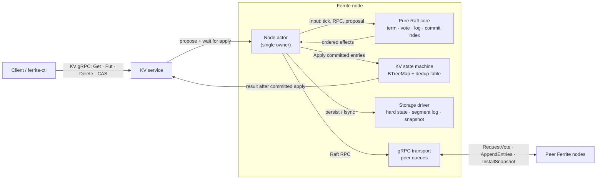

# Ferrite

Ferrite is an experimental, Raft-backed distributed key-value store written in Rust. It separates the consensus state machine from I/O, then drives the same Raft core through a deterministic simulator and a Tokio + gRPC runtime.

> **Project status — active development.** Leader election, replication, gRPC node-to-node transport, the KV API, disk-backed Raft state, and snapshots are implemented and covered by unit, simulator, and cluster tests. Production recovery currently rebuilds the KV state machine through Raft catch-up rather than restoring it directly from a saved snapshot. See [Known limitations](#known-limitations) before relying on Ferrite for data you cannot lose.

## Why Ferrite

- **Protocol-first design:** the Raft core is synchronous, deterministic, and has no clock, network, or filesystem dependency.
- **A real runtime and a simulator:** exercise identical Raft transitions through either deterministic logical time or Tokio, gRPC, and disk storage.
- **Durability ordering:** hard state and log changes are persisted before dependent replies, sends, or state-machine application; a failed commit fences the node.
- **Idempotent client retries:** each KV command carries `(client_id, seq_num)` so a lost response can be retried without applying the write twice.
- **Inspectable systems code:** consensus, storage, transport, and state-machine responsibilities live in small, explicit modules.

## Architecture

The node actor is the sole owner of mutable Raft state, log storage, and the KV state machine. RPC handlers, timers, and client requests communicate with it using channels; no consensus state is shared behind a lock.



The boundary is intentional: `src/raft/` returns ordered effects such as `PersistLog`, `Send`, and `Apply`; drivers execute them. That makes the consensus core reproducible in the simulator and keeps storage/network failure behavior at the runtime boundary.

## Write and replication path

For a successful KV operation, the leader first durably records the command, replicates it to a quorum, advances `commitIndex`, and applies it in log order. Followers only acknowledge an `AppendEntries` success after their required log change is durable.

```mermaid
sequenceDiagram
    autonumber
    participant Client
    participant Leader as Leader: KV service + node actor
    participant LDisk as Leader disk
    participant F1 as Follower 1
    participant F1Disk as Follower 1 disk
    participant F2 as Follower 2
    participant F2Disk as Follower 2 disk
    participant FSM as Leader KV state machine

    Client->>Leader: Put(key, value, client_id, seq_num)
    Leader->>Leader: Append command at (index, term)
    Leader->>LDisk: PersistLog + fsync
    LDisk-->>Leader: durable
    par Replicate to followers
        Leader->>F1: AppendEntries(prev, entry, leaderCommit)
        F1->>F1Disk: append/truncate + fsync
        F1Disk-->>F1: durable
        F1-->>Leader: AppendEntriesResponse(success, matchIndex)
    and
        Leader->>F2: AppendEntries(prev, entry, leaderCommit)
        F2->>F2Disk: append/truncate + fsync
        F2Disk-->>F2: durable
        F2-->>Leader: AppendEntriesResponse(success, matchIndex)
    end
    Leader->>Leader: quorum for a current-term entry; advance commitIndex
    Leader->>FSM: Apply entries in index order
    FSM-->>Leader: command result
    Leader-->>Client: response
    Leader->>F1: subsequent AppendEntries(leaderCommit)
    Leader->>F2: subsequent AppendEntries(leaderCommit)
```

An unsuccessful replica response backs up that peer's `nextIndex` and retries from a matching prefix. A follower behind the compacted log boundary receives `InstallSnapshot` rather than an invalid append anchor.

## Guarantees and semantics

Ferrite implements the core Raft rules behind these behaviors:

| Area | Behavior |
|---|---|
| Leadership | Randomized election timeouts, one vote per persisted term, and immediate step-down on a higher term. |
| Voting | A candidate must be at least as up-to-date as the voter, comparing last-log term and then index. |
| Replication | `AppendEntries` checks the preceding index/term, truncates conflicting suffixes, and catches peers up with `nextIndex`/`matchIndex`. |
| Commit | The leader advances commit by replica counting only for entries from its current term. Older entries commit indirectly. |
| Application | Committed entries apply strictly in ascending index order. |
| Client retries | Each client operation carries `(client_id, seq_num)`; a duplicate request returns the cached result instead of applying again. |
| Reads | `Get` is submitted through the replicated log, so it waits for committed application instead of reading a local replica directly. ReadIndex is not yet implemented. |

## Quick start

### Prerequisites

- Rust **1.83+** (edition 2024; `rust-toolchain.toml` tracks stable)
- `protoc` to compile the gRPC definitions in `proto/`

```sh
# macOS
brew install protobuf

# Debian / Ubuntu
sudo apt-get install -y protobuf-compiler

cargo build --all-targets
cargo test --all-targets
```

Run a deterministic election:

```sh
cargo run --bin ferrite-sim -- run --scenario election --seed 7
```

Run the replication scenario, which elects a leader and checks 100 writes converge to the same log:

```sh
cargo run --bin ferrite-sim -- run --scenario replicate --seed 7
```

## Run a local cluster

Generate a three-node configuration. Each node gets a Raft port starting at `7001` and a client/KV port starting at `8001`.

```sh
cargo run --bin ferrite -- init --nodes 3 --dir ./cluster
```

In three terminals, start the nodes:

```sh
cargo run --bin ferrite -- run --config ./cluster/node1.toml
cargo run --bin ferrite -- run --config ./cluster/node2.toml
cargo run --bin ferrite -- run --config ./cluster/node3.toml
```

Then issue operations through the retrying client. It follows leader hints, rotates across endpoints when needed, and retains the same sequence number across a retry.

```sh
ENDPOINTS=127.0.0.1:8001,127.0.0.1:8002,127.0.0.1:8003

cargo run --bin ferrite-ctl -- --endpoints "$ENDPOINTS" put greeting hello
cargo run --bin ferrite-ctl -- --endpoints "$ENDPOINTS" get greeting
cargo run --bin ferrite-ctl -- --endpoints "$ENDPOINTS" delete greeting

# Create only when the key is absent; use a version for an update.
cargo run --bin ferrite-ctl -- --endpoints "$ENDPOINTS" \
  cas greeting --expect absent --value hello
```

`ferrite-ctl cas` exits with code `2` when its compare-and-swap condition does not hold.

## Configuration

`ferrite init` produces validated TOML. All nodes list the full voter set, including themselves.

```toml
[cluster]
node_id     = 1
listen_addr = "127.0.0.1:7001" # Raft peer RPC
client_addr = "127.0.0.1:8001" # KV API

[[cluster.peers]]
id   = 1
addr = "127.0.0.1:7001"

[[cluster.peers]]
id   = 2
addr = "127.0.0.1:7002"

[[cluster.peers]]
id   = 3
addr = "127.0.0.1:7003"

[[cluster.client_endpoints]]
id   = 1
addr = "127.0.0.1:8001"

[[cluster.client_endpoints]]
id   = 2
addr = "127.0.0.1:8002"

[[cluster.client_endpoints]]
id   = 3
addr = "127.0.0.1:8003"

[raft]
heartbeat_interval_ms   = 50
rpc_timeout_ms          = 100
election_timeout_min_ms = 300
election_timeout_max_ms = 600
compaction_threshold    = 1000

[storage]
backend  = "disk" # or "memory"
data_dir = "./data/node1"

[logging]
format = "pretty" # or "json"
```

Check configuration before starting a node:

```sh
cargo run --bin ferrite -- validate --config ./cluster/node1.toml
```

CLI overrides take precedence over TOML, which takes precedence over compiled defaults. Repeated `--peer ID@HOST:PORT` and `--client-endpoint ID@HOST:PORT` flags replace their corresponding configured lists.

## Storage and failure behavior

The `disk` backend uses CRC-protected append-only segment files for the Raft log, plus atomically replaced hard-state and snapshot files. Recovery scans segments in sequence order; a torn tail on only the newest segment is truncated, while corruption in an earlier segment is reported. Segment rotation defaults to 16 MiB.

The actor group-commits all persistence effects in a batch before executing a dependent send or apply. If persistence fails, it stops the node rather than returning a successful replication acknowledgement or KV result. Disk I/O runs in `spawn_blocking`; the Raft core itself never opens a file or awaits I/O.

## Components

| Path | Responsibility |
|---|---|
| `src/raft/` | Pure Raft transition logic: elections, replication, log matching, commit, snapshots, and invariants. |
| `src/server/node.rs` | Tokio actor that serializes inputs, groups durable writes, applies entries, and supervises peer tasks. |
| `src/transport/` | gRPC message conversion and outbound peer transport. |
| `src/raft/storage/` | Memory storage plus CRC-protected, segment-file disk storage and recovery. |
| `src/kv/` | Deterministic KV state machine, versions, CAS, and idempotency table. |
| `src/server/kv_service.rs` | Client gRPC API; proposes commands and waits for the matching applied entry. |
| `src/client/` / `src/bin/ferrite-ctl.rs` | Leader-aware retrying client and command-line interface. |
| `src/sim/` | Seeded, logical-clock simulator with canonical traces and scenarios. |
| `proto/` | Raft peer and KV gRPC contracts. |

## Verification

The test strategy combines focused protocol tests, deterministic simulation, crash/restart cases, and networked cluster/KV integration tests.

| Task | Command |
|---|---|
| Build | `cargo build --all-targets` |
| Tests | `cargo test --all-targets` |
| Lint | `cargo clippy --all-targets --all-features -- -D warnings` |
| Format check | `cargo fmt --check` |
| Determinism stress | `cargo test --lib sim::tests::same_seed_is_deterministic_for_one_thousand_seeds -- --ignored` |
| Golden trace | `cargo test --lib sim::tests::canonical_trace_matches_golden_fixture` |
| 1000-seed acceptance | `CARGO_PROFILE_RELEASE_DEBUG_ASSERTIONS=true cargo test --release --lib -- --ignored elects_exactly_one_leader_within_600_ticks_for_1000_seeds replicate_100_writes_identical_logs_for_1000_seeds` |

Optional local tools (not required by CI):

```sh
# Faster parallel test runner, if installed: cargo install cargo-nextest
cargo nextest run --all-targets

# Undefined-behavior check under Miri (nightly)
MIRIFLAGS="-Zmiri-disable-isolation" cargo miri test
```

CI also checks that the simulator remains deterministic, the Raft core stays synchronous and free of network I/O, and the KV state machine remains deterministic. Contributor rules and concurrency requirements are in [AGENTS.md](AGENTS.md).

## Known limitations

- Ferrite is not yet production-ready; its API and on-disk format should be treated as unstable.
- A runtime restart rebuilds the KV state machine by Raft catch-up. Direct restoration of state-machine data from a persisted snapshot is not wired into startup yet.
- Reads are log-replicated for correctness. ReadIndex-based linearizable reads are planned to avoid the write-path cost for reads.
- Membership changes, authentication/TLS, client-history linearizability checking, benchmark reporting, and adversarial simulated network faults (drop/delay/reorder/partition) are still future work.

## Roadmap

Shipped foundations (election, replication, disk log, node driver/gRPC, KV API, compaction/`InstallSnapshot`) live in the tree; older drafts in [`issue-drafts/`](issue-drafts/) for those areas are historical.

Near-term follow-ups still tracked there:

- Simulated network faults (`issue-02`)
- Linearizability checker (`issue-07`)
- ReadIndex (`issue-08`)
- Fast backup hints (`issue-09`)
- Benchmark harness (`issue-10`)

## Contributing

Please read [AGENTS.md](AGENTS.md) before changing protocol or runtime code. In particular, preserve Raft durability ordering, do not hold locks across `await`, and keep the consensus core independent of networking, filesystem I/O, and wall-clock time.
